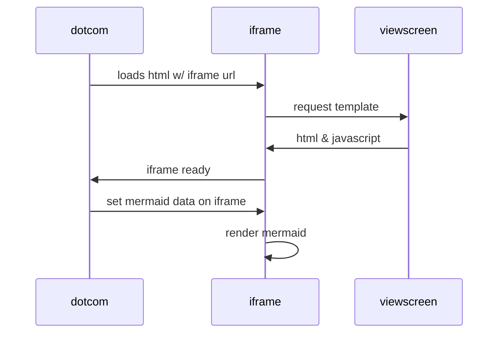

# Git u nastavi

Na konferenciji u Splitu održano je predavanje i radionica na temu Git-a u nastavi. 

## Učenici vole Git

Kako natjerati učenike da koriste Git?

## Dijgrami u Markdownu

Jednostavan primjer dijagrama: 

Prvi primjer "cjevovoda": 

